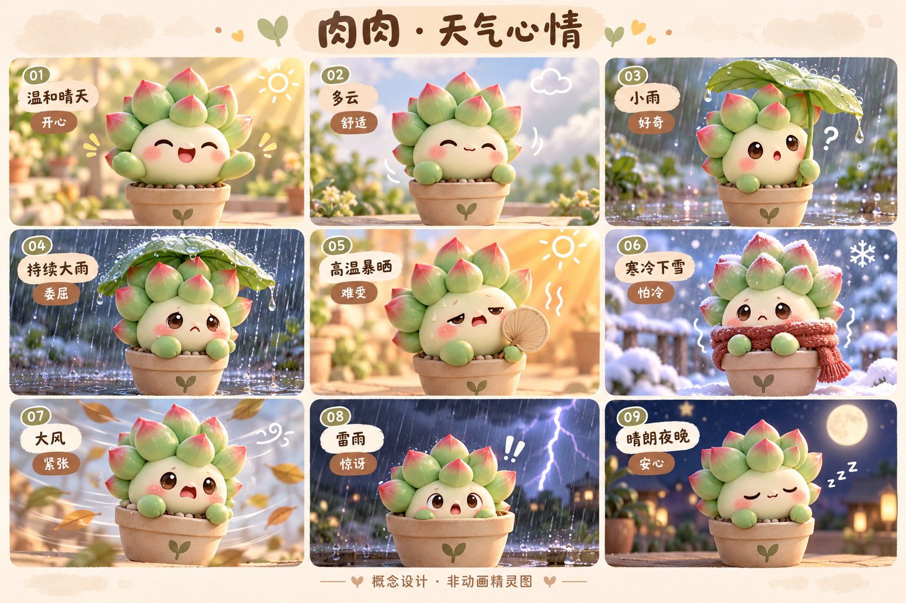

# 肉肉 RouRou · Codex 桌面宠物

粉尖绿叶、陶土花盆的小多肉。这里保存角色参考、16表情、天气状态设计和 macOS 安装脚本。

**当前为设计阶段，没有可安装的正式动画包。天气自动联动尚未实现。**



## 文件
- assets/：用户原图与生成的天气概念设计。
- docs/：动作清单和正式素材制作规范。
- install.sh：macOS 安装脚本，缺少正式 pet.json/精灵图时停止，不覆盖已安装的肉肉。
- pet/：未来存放通过 hatch-pet 验证的正式宠物包。

## 安装（正式动画发布后才可使用）
下载仓库 ZIP 并解压，在目录内执行 `bash install.sh`。脚本安装到 `${CODEX_HOME:-$HOME/.codex}/pets/rourou`，然后在宠物选择界面选择肉肉。

仓库发布后的单命令形式（需要 Git；当前会提示缺少正式动画包）：

```bash
git clone https://github.com/AbelChange/rourou-codex-pet.git && bash rourou-codex-pet/install.sh
```

不需要 sudo。上述默认分支命令是设计阶段示例；正式发布应改为固定版本标签，保证可重复安装。安装完成不代表自动激活，也不提供天气接口。

## 正式发布前
制作9种动画与16视线方向，完成透明 v2 精灵图及 hatch-pet 验证，保存动画预览和QA报告。将 pet.json、spritesheet.png/WebP 放到 pet/，并在该目录对这两个文件生成 SHA256SUMS。随后创建版本标签和 GitHub Release；需要在目标应用版本实测安装。

## 使用许可
目前尚未选择开源或素材授权条款。公开可查看不等于授予角色、图片的商业使用或再分发许可；具体授权由作者另行说明。
